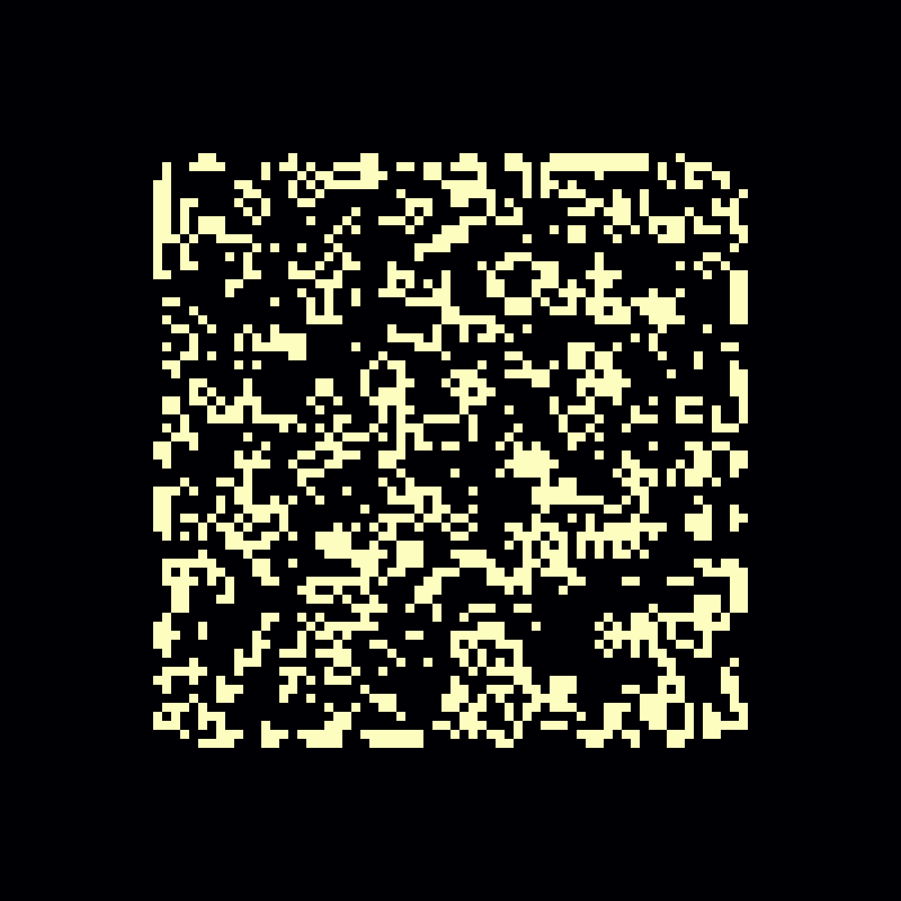
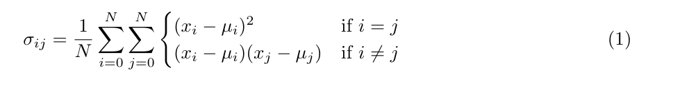
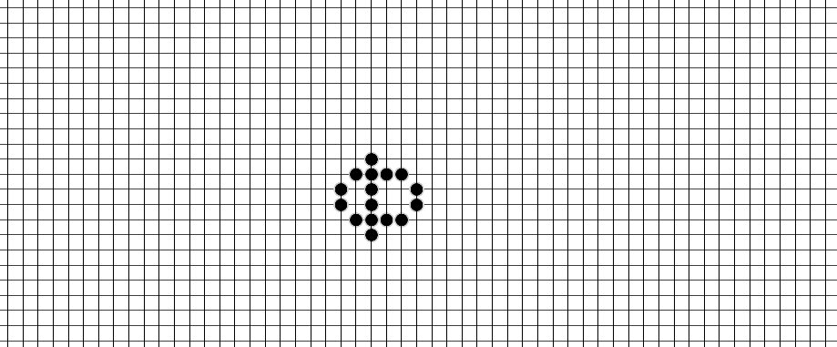

# Movement in the Morley Rules: 
## A (Demonstration) Entry to the [Carle's Game](https://rivesunder.threadless.com/designs/puffer-progression) challenge.

Greetings apertonauts! This repository describes an evolutionary search for mobile patterns in the Move/Morley Life-like cellular automata rules (B368/S245). I used a covariance matrix adaptation evolution strategy (CMA-ES [Hansen 2016](https://hal.inria.fr/hal-01297037/file/tutorial.pdf)) to find a minimal glider known as "the jellyfish" and also the Morley common puffer. If you want to skip directly to the demonstration of the patterns, use the link below to spin up an interactive bokeh app on [mybinder.org](https://mybinder.org), or clone this repository and open up the notebook at `notebooks/evaluation.ipynb`. For more information on the strategy I used and a discussion of the results, read on. 

[`https://mybinder.org/v2/gh/riveSunder/movement_in_morley/master?urlpath=/proxy/5006/bokeh-app`](https://mybinder.org/v2/gh/riveSunder/movement_in_morley/master?urlpath=/proxy/5006/bokeh-app)

```
# clone this repository and install dependencies, in order to evaluate the found patterns in a Jupyter notebook

# set up a virtual environment with your choice of manager, e.g. virtualenv
virtualenv morley --python=python3
source morley/bin/activate

# clone repo
git clone https://github.com/rivesunder/moving_in_morley
cd moving_in_morley
pip install -e .

# install CARLE
git clone https://github.com/rivesunder/carle
cd carle
pip install -e .
cd ../

# launching jupyter notebook and open notebooks/evaluation.ipynb 
jupyter notebook
```

## A Note on the Rule-String Convention

Life-like cellular automata are defined in grid universes divided into cells, where each cell has a state of either 1 or 0, _aka_ on or off, _aka_ alive or dead. The rules defining the dynamics of a CA determine what conditions lead to a transition from 0 to 1 ("birth") or staying in a state of 1 ("survive"), and all other cells transition to a state of 0 at each time step. Part of what makes a CA Life-like (as in, similar to John Conway's Game of Life) is that the next state of a given cell is fully determined by its current state and the sum of the states of its immediate neighbers, _i.e._ the contents of its Moore neighborhood.

<div align="center">

<br>
<em>A Moore neighborhood</em>
</div>

We usually write down the rules governing Life-like CA as a rule-string in the format B3/S23. That rule-string, which happens to define Conway's Life, signifies that cells transition from 0 to 1 if they have exactly 3 neighbors, stay 1 if they have 2 or 3 neighbors, and become 0 if they have any other number of neighbors. The Morley rules used in this experiment are written as B368/S245, therefore births (0 to 1) occur for 3, 6, or 8 neighbors, survival (1 to 1) occurs for 2, 4, or 5 neighbors, and all other neighbor counts cause a cell to become 0 if it wasn't already. 

## The Morley/Move Rules B368/S245

The Life-like Morley rule set B368/S245, also known as [Move](https://www.conwaylife.com/wiki/OCA:Move), has many similarities to the seminal totalistic rule set known as [Conway's Game of Life](https://en.wikipedia.org/wiki/Conway%27s_Game_of_Life), B3/S23. Unlike Life, random initializations in a grid subject to the Morley rules tend to quickly settle on still-life and oscillator patterns. For example: 

<div align="center">

</div>

B368/S245 is capable of producing mobile patterns like gliders and spaceships and is considered Turing complete, as it has been proven to be capable of simulating elementary CA rule 110 by [lazyboi](https://www.conwaylife.com/forums/viewtopic.php?t=&p=102550#p102550) on [conwaylife.com](https://www.conwaylife.com/) forums in August 2020. Several of these patterns are relatively common, including the so-called jellyfish glider shown below:

<div align="center">

</div>

# Covariance Matrix Optimization Evolution Strategy

CMA-ES ([Hansen 2016](https://hal.inria.fr/hal-01297037/file/tutorial.pdf)) is an effective optimization strategy applicable to a wide range of optimization tasks, including direct optimization problems like this one in which the aim is to find starting patterns that evolve into mobile machines in the Morley CA. It's also an effective strategy for indirect optimization, _e.g._ optimizing the parameters of a policy that in turn creates patterns (or agent actions in general). In this experiment, CMA-ES was effective at discovering mobile patterns, although it does tend to converge on the same common jellyfish and puffer patterns.  

We can describe the covariance calculation as 

<div align="center">

</div>


Calculating the covariance matrix in practice is, as is so often the case in modern machine learning, a matter of matrix multiplies:

```
covariance = np.matmul((elite_means - prev_generation_mean).T, (elite_means - prev_generation_mean))
```

For details about my implementation of CMA-ES used in this experiment, have a look at the [source code](https://github.com/riveSunder/carles_game/blob/master/game_of_carle/algos/cma.py), for a succinct explanation check out out Harmaru's [blog post](https://blog.otoro.net/2017/10/29/visual-evolution-strategies/), another implementation in [bevodevo](https://github.com/riveSunder/bevodevo/blob/main/bevodevo/algos/cmaes.py), or Nikolaus Hansen's [tutorial paper](https://hal.inria.fr/hal-01297037/file/tutorial.pdf) for a more detailed view. 

The part of CMA-ES that consumes the most time during training (at least in my hands) is sampling from the resulting multivariate distribution, and not calculating covariance in the first place as I naively expected when I was first learnign about the algorithm. Indeed, distribution sampling can be quite time-consuming, and it limits the utility of CMA-ES for optimizing large numbers of parameters (David Ha gives a heuristic of 1000 parameters being the practical boundary in his [blog on the subject](https://blog.otoro.net/2017/10/29/visual-evolution-strategies/)). CARLE has a default action space of 64 by 64 cell toggles, which comes out to 4096 parameters when optimized directly, and does make for a slow learning process. For faster training, I programmed the `Toggle` agent to only operate within the central 32 by 32 section of the action space, or 1024 parameters, and this turns out to be a good match for my patience and compute resources. As an added benefit, it leaves a buffer zone in between the central pattern that `Toggle` acts on and the boundary of the action space where the reward wrapper begins to consider cell states. This helps to avoid a chaotic boundary bonus, where cells transiently becoming active near the action space boundary generate a reward from the `SpeedDetector` reward wrapper without actually generating interesting mobile patterns. I often see emergence of a chaotic boundary strategy when training policies that currently do have access to the entire action space, like [`CARLA`](https://github.com/riveSunder/moving_in_morley/blob/master/game_of_carle/agents/carla.py) and [`HARLI`](https://github.com/riveSunder/moving_in_morley/blob/master/game_of_carle/agents/harli.py). 

Although a Morley CA universe has a lower chance of producing mobile patterns from random initializations, it does produce an interesting puffer (spaceship that leaves a trail) with somewhat high frequency. This puffer has a period of 170 time steps and leaves behind a trail of simple oscillators. It's also the subject of the [Carle's Game t-shirt](https://rivesunder.threadless.com/designs/puffer-progression), which I plan to send to the first 10 participants in the contest (provided they send me an address that Threadless ships to) not including yours truly, who already has one. 

<div align="center">

</div>

Anyway, if you want to have a look at the patterns discovered in my direct-optimization CMA-ES experiments, check out the interactive demonstration on mybinder:

[`https://mybinder.org/v2/gh/riveSunder/movement_in_morley/master?urlpath=/proxy/5006/bokeh-app`](https://mybinder.org/v2/gh/riveSunder/movement_in_morley/master?urlpath=/proxy/5006/bokeh-app)

## Appendum

<em>
Note that this is not a real entry to the [Carle's Game](https://github.com/rivesunder/carles_games) competition, as the progenitor of the contest and myself are one and the same. It is, however, an example of how one might go about addressing the challenge and writing up an experiment in order to enter the contest. My intention with this example is that it will pique your interest and encourage the reader to participate in the contest as an entrant or judge, and serve as a reminder that you don't have to solve open-endedness or AI in order to make a meaningful contribution to the challenge. In fact, you're more than welcome, nay, encouraged to take advantage of any of the tools provided in this repo or its parent in order to explore the world of machine interaction (or machine-aided interaction) with Life-like cellular automata in CARLE. 
</em>

<em>
Good luck, thanks for reading, and I wish you well in your explorations. 
</em>

